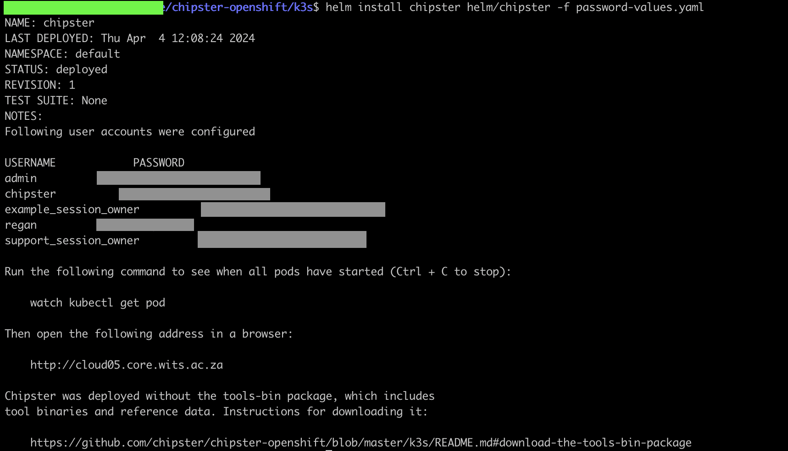
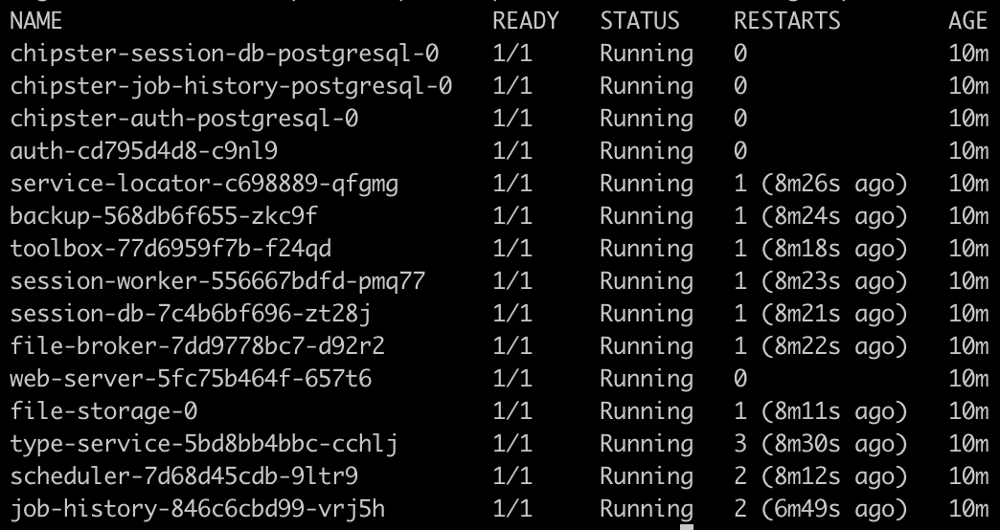
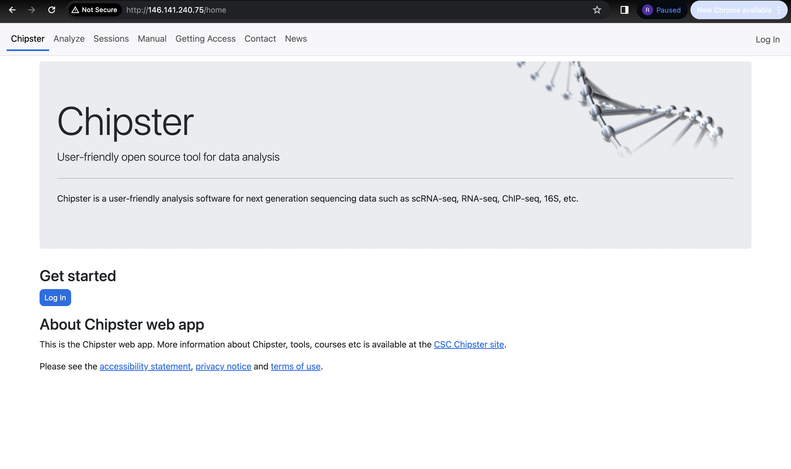

# Chipster-POC

## Introduction
This repository contains all configuration and manifest files for the installation or deployment of [chipster](https://github.com/chipster/chipster-openshift/tree/k3s) on our K3s cluster (the K3s cluster is currently hosting the [Gen3](https://github.com/sbimb/gen3-dev) workloads).

## Setup of Chipster
The instructions for installing `chipster` can be found in [their repository](https://github.com/chipster/chipster-openshift/blob/k3s/k3s/README.md). However, there are some subtle differences in our case, since we already have a K3s cluster running on bare-metal Ubuntu. The rest of this README will assume there is a K3s cluster already running with `helm` and `kubectl` already installed, as well as the Linux `apt` package manager. However, instructions for installing `k3s` and `helm` can be found in the [documentation directory](documentation/setting_up_k3s_on_ubuntu.md) of this repository.      

Firstly, we need to have some prerequisites installed on our Ubuntu machine, namely:
- [ansible](https://docs.ansible.com/)
- [yq](https://github.com/mikefarah/yq/blob/master/README.md)
- [diceware](https://pypi.org/project/diceware/)

There are many different ways to install the above tools, so we'll cover the way in which we performed the installation. To install `ansible`, run:
```bash
sudo apt install software-properties-common
sudo add-apt-repository --yes --update ppa:ansible/ansible
sudo apt install -y ansible
```

To install `yq`, the following command can be run:
```bash
sudo wget -qO /usr/local/bin/yq https://github.com/mikefarah/yq/releases/latest/download/yq_linux_amd64
```
Then permissions need to be given to the folder where the executable is located:
```bash
sudo chmod a+x /usr/local/bin/yq
```
To verify that the installation was successful, run:
```bash
yq --version
```
To install `diceware`, run:
```bash
sudo apt-get -y install diceware
```
The installation can be verified with:
```bash
diceware --version
```
If all the prerequisite libraries or tools have been successfully installed, we should be ready to clone the `chipster` repository now:
```bash
 git clone https://github.com/chipster/chipster-openshift.git
```
Navigate into the `k3s` directory:
```bash
cd chipster-openshift/k3s
```
This directory contains the `helm` charts for the `chipster` workloads. Inside the `helm` directory, there exists a `values.yaml` file that will need to be used to perform a Helm deployment. If we take a look at the `values.yaml` file, we'll notice that the `password` fields are all empty. We need to get those passwords before a Helm deployment can be successfully performed.   

There exists a password generating script inside the repository, which by now should have been cloned and probably located at `/yourHomeDirectory/chipster-openshift/k3s`. Inside this directory, the password generator script can be executed with:
```bash
bash generate-passwords.bash
``` 
A kubernetes secret called `passwords` gets created and saved to the `default` namespace. This secret contains all the passwords that are needed in the `values.yaml` for the Helm deployment. The base64 encoded value for the passwords can be seen in the secret with:
```bash
kubectl get secret passwords -o yaml
```
In the `data` key of the secret manifest, a base64 encoded value exists which contains all the passwords in JSON format. To see these passwords, the following command can be run to decode the passwords:
```bash
echo 'base64 value in secret' | base64 --decode
```
These passwords could be manually copied and pasted into the `values.yaml` that is inside the `helm` directly, but this is tedious and may result in errors. A slightly better solution would be to convert the decoded passwords from JSON to YAML (call it `password-values.yaml` and save it in the current working directory). In this YAML file, add yourself as a user and add the DNS name of your machine, e.g.
```yaml
host: cloud05.core.wits.ac.za
users:
  regan:
    password: "YourOwnPassword"
```
and then run the following commands:
```bash
helm dependency update helm/chipster
helm install chipster helm/chipster -f password-values.yaml
```
After the Helm deployment, the following message (or something very similar) should be displayed:   
     

There might be some issues regarding the default `traefik` ingress controller that **K3s** uses. If an error is encountered that mentions missing CRDs (custom resource definitions), then those `traefik` CRDs need to be manually installed on the cluster.    

Inside this repository, there exists a `traefik` directory which contains several `traefik` manifests. The following manifests should be applied:
```bash
kubectl apply -f 001-crd.yaml
kubectl apply -f 001-rbac.yaml
kubectl apply -f 004-service.yaml
kubectl apply -f 005-deployment.yaml
```
After these `traefik` resources have been created, the Helm deployment should work as expected. After a few minutes, we should see that the `chipster` pods are up and running:
```bash
kubectl get pods
```
     

When all the pods are up and running, the Chipster web UI should be accessible on the IP address of the node, e.g.
```bash
curl http://<nodeIPAddress>
```
     

To make full use of all the Chipster services, the [tools-bin](https://github.com/chipster/chipster-openshift/blob/k3s/k3s/README.md#download-the-tools-bin-package) package needs to be downloaded and installed. This package is about 500Gb in size, so resource-intensive machine would be needed for such an installation.

